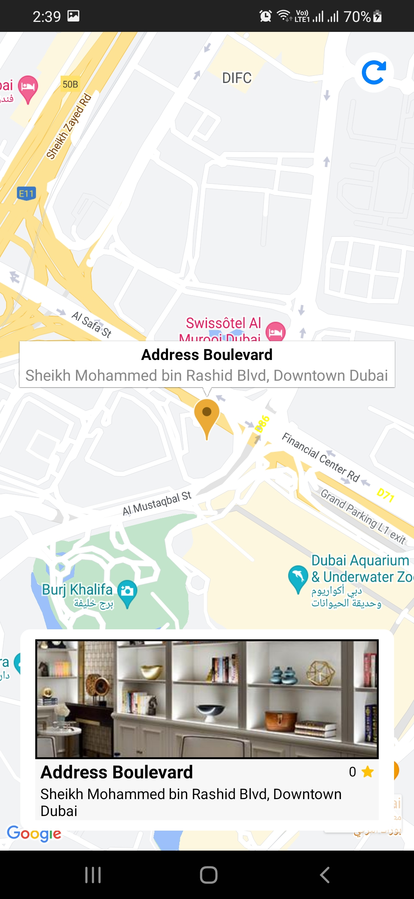
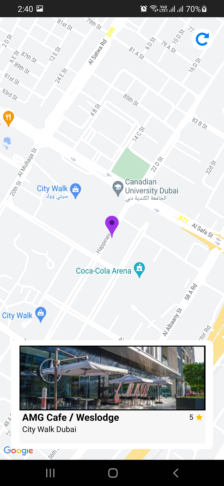
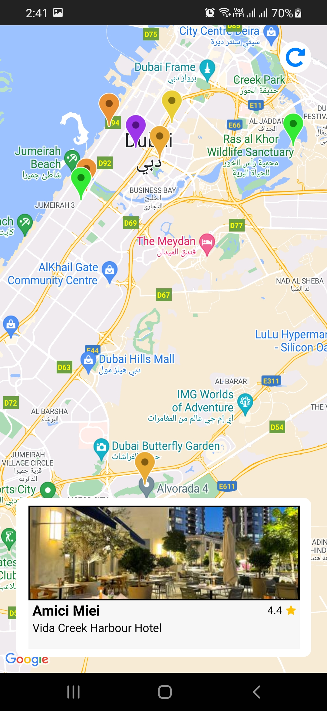
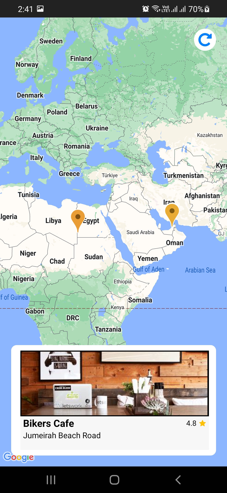
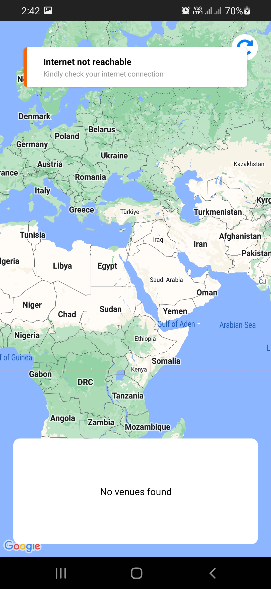

# fahad-google-events in REACT NATIVE

It's a project created in React Native having mainly Google Maps integration with any location venues with different color MapMarkers and horizontal scrollable cards.

## Table of Contents

- [Features](#features)
- [Demo](#demo)
- [Installation](#installation)
- [Usage](#usage)
- [API Integration](#api-integration)
- [Dependencies](#dependencies)
- [Screenshots](#screenshots)
- [License](#license)
- [Author](#author)

## Features

- Google Maps Integration.
- Custom color MapMarkers.
- Separate custom component for venue card view.
- Horizontal ScrollView for venue cards.
- Refresh button to refresh/reload venues from API.
- Used animation to animate to related marker upon swiping venue cards horizontally.
- Scrolled to related card upon clicking of location marker.
- Used Axios for API integration.
- Used FastImage for Image caching for image load time optimization.
- Used advanced Toast for exception handlings/error messages.
- Used Redux-Toolkit for global state management of venues list.
- Created splash screen via bootsplash.

## Demo

This is a low resolution short GIF to auto-play here.

To see a high resolution video of the project, click below youtube link:

[Youtube Link](https://www.youtube.com/watch?v=z38wvF_0ZvY)

https://www.youtube.com/watch?v=z38wvF_0ZvY

## Installation

Install the release APK in your Android via this Link [this Link](installables/FahadGoogleEvents%20V23.05.22.02.apk)

OR by navigating to installables folder manually in this repo where release APK is named as FahadGoogleEvents V23.05.22.02.apk

## Usage

Clone or download this project source.

Place your GEO_API_KEY in AndroidManifest.xml located at: `android\app\src\main\AndroidManifest.xml`

Place your VENUE_API_URL in AppStrings.js in BaseURL property located at: `src\utilities\AppStrings.js`

Run command in terminal: `yarn install`

Run project using this command: `npx react-native run-android`

## API Integration

API is integrated via Axios.

To get venues data from your API, Place your VENUE_API_URL in AppStrings.js in BaseURL property located at: `src\utilities\AppStrings.js`

## Dependencies

    "@react-native-community/netinfo": "^9.3.10",
    "@reduxjs/toolkit": "^1.9.5",
    "axios": "^1.4.0",
    "react": "18.1.0",
    "react-native": "0.70.0",
    "react-native-bootsplash": "^4.7.1",
    "react-native-fast-image": "^8.6.3",
    "react-native-maps": "^1.7.1",
    "react-native-toast-message": "^2.1.6",
    "react-redux": "^8.0.5",

## Screenshots

Here are some HIGH RESOLUTION Screenshots of my personal physical device Samsung A30.

_Getting venues from API_

_Focused on first venue_

_Horizontally scrolled to another venue_

_Multiple venues as different color map markers on map_

_Zoomed out to see different country markers_

_Exception handling with Toast_

## Author

- Name: Fahad Ali Qureshi
- Profession: Software Engineer
- Specialization: Cross-platform mobile app development

## License

This project is licensed under the [MIT License](LICENSE.md).
