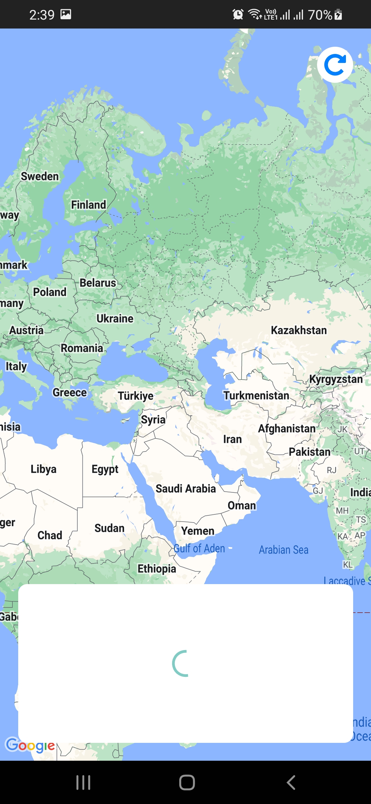

# fahad-google-events

It's a project created in React Native having mainly Google Maps integration with any location venues with different color MapMarkers and horizontal scrollable cards.

## Table of Contents

- [Features](#features)
- [Demo](#demo)
- [Screenshots](#screenshots)
- [Installation](#installation)
- [Usage](#usage)
- [API Integration](#api-integration)
- [Dependencies](#dependencies)
- [License](#license)
- [Author](#author)

## Features

- List the main features of your app here.
- Describe each feature in a few sentences.

## Demo

This is a low resolution short GIF to auto-play here.

To see a video demo of the project, click below youtube link:

[Youtube Link](https://www.youtube.com/watch?v=z38wvF_0ZvY)

https://www.youtube.com/watch?v=z38wvF_0ZvY

## Screenshots

_Splash screen_

_Getting venues from API_

_Focused on first venue_

_Horizontally scrolled to another venue_

_Multiple venues as different color map markers on map_

_Zoomed out to see different country markers_

_Exception handling with Toast_

## Installation

Provide instructions on how to install and set up your project locally. Include any prerequisites or system requirements.

## Usage

Explain how to use your app, including any necessary configuration or setup. You can include code snippets or examples to make it easier for others to understand.

## API Integration

Describe how you integrated the API in your app, including the libraries or tools used, and any important code snippets.

## Dependencies

List the main dependencies of your project here. You can include both libraries and tools.

## Author

- Name: Fahad Ali Qureshi
- Profession: Software Engineer
- Specialization: Cross-platform mobile app development

## License

This project is licensed under the [MIT License](LICENSE.md).
